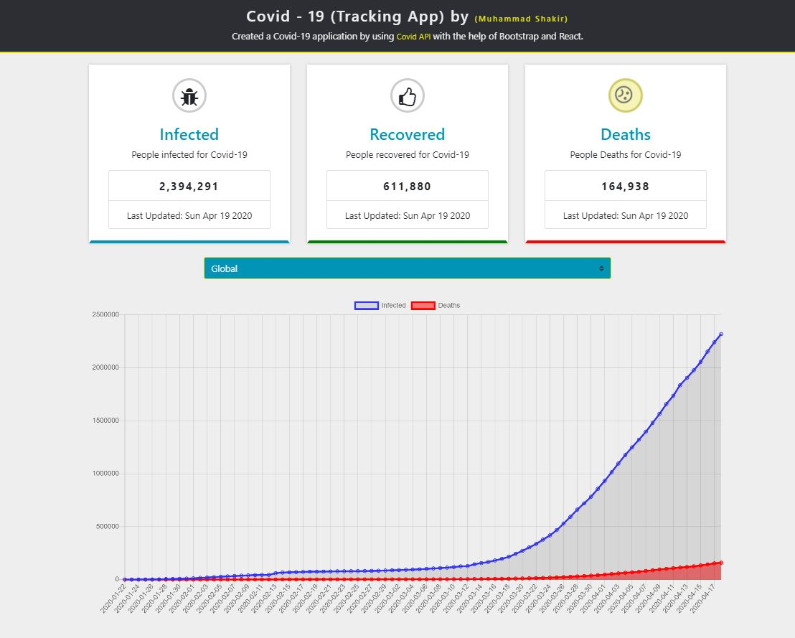

### Covid Application.
Created a Complete Covid-19 Application by using the React and Bootstrap. In this Application, I used Axios, ChartJS, Countup, and Twitter Bootstrap dependencies in order get the smooth transition.
<ul>
<li> CountUp for give the number Transition </li>
<li> Axios for fetching the APIs </li>
<li> ChartJS for importing the Chart from the react chartjs library </li>
<li> twitter bootstrap for UI </li>

Used One Class based component (APP.js) and four functional Component (Cards, Chart, Header, CountryPicker)
# API
The API is used to fetched all the data from 'https://covid19.mathdro.id/api'

Final Output.

